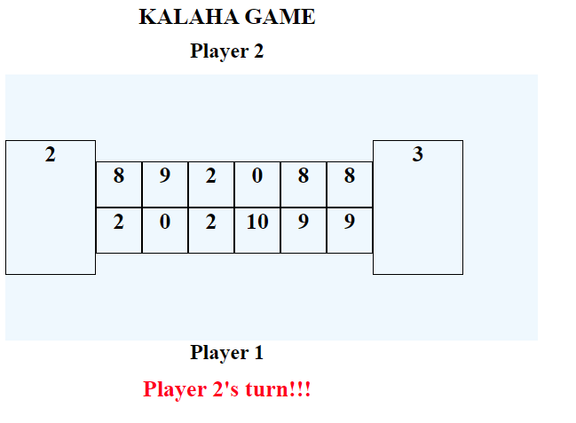

# Kalah Web Application Game

For building and running the application:

Spring Boot,
Java 11,
Junit 5,
Gradle 4.10,
JQuery, 
HTML,
CSS are used.

You can run the application using Gradle

```sh-session
$ ./gradlew bootRun
```


Go to http://localhost:8080/ to start the game.


